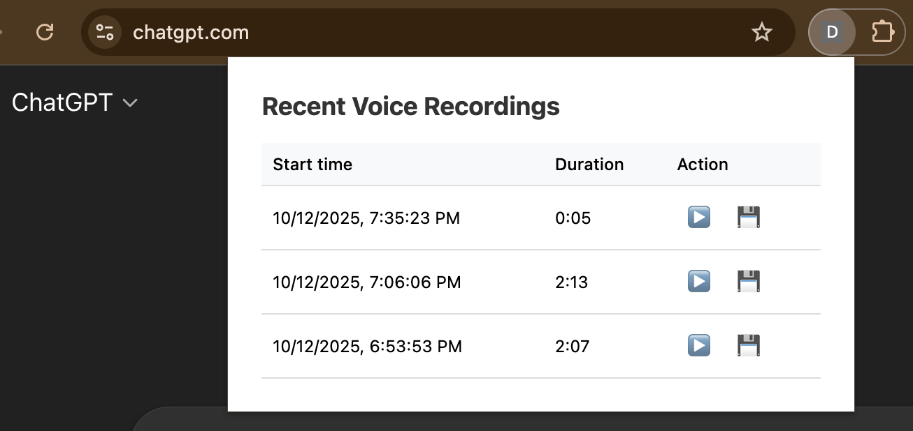

# Dictation Saver for ChatGPT

Dictation Saver for ChatGPT is a Chrome extension that helps you keep a backup of your ChatGPT voice dictations. Sometimes, ChatGPT’s built-in transcription can fail, misidentify the spoken language, or return empty text, causing you to lose the content you just spoke. This extension exists to prevent that loss by recording your audio in parallel while you dictate.

It hooks into ChatGPT’s dictation buttons and automatically captures your speech. You can then download the most recent recording from the extension’s popup, ensuring that even if the transcription fails, your original audio is preserved. The extension supports a maximum 10-minute recording, matching ChatGPT’s own dictation limit.

## Screenshot

## Demo video

<video src="https://github.com/user-attachments/assets/e3fb67ba-dc76-4d90-8554-b5c95ec5b416" width="320" height="240" controls></video>
